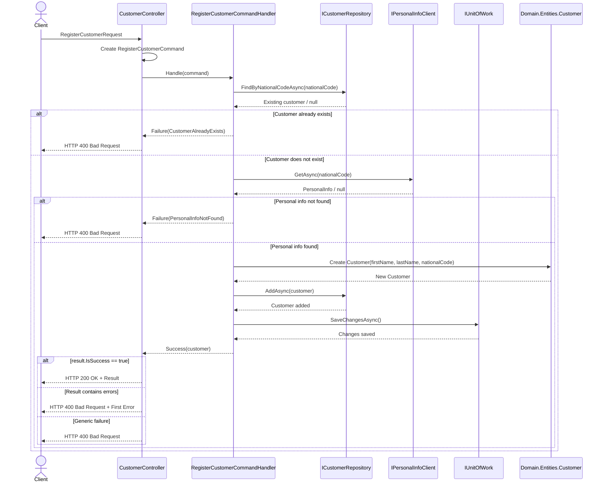
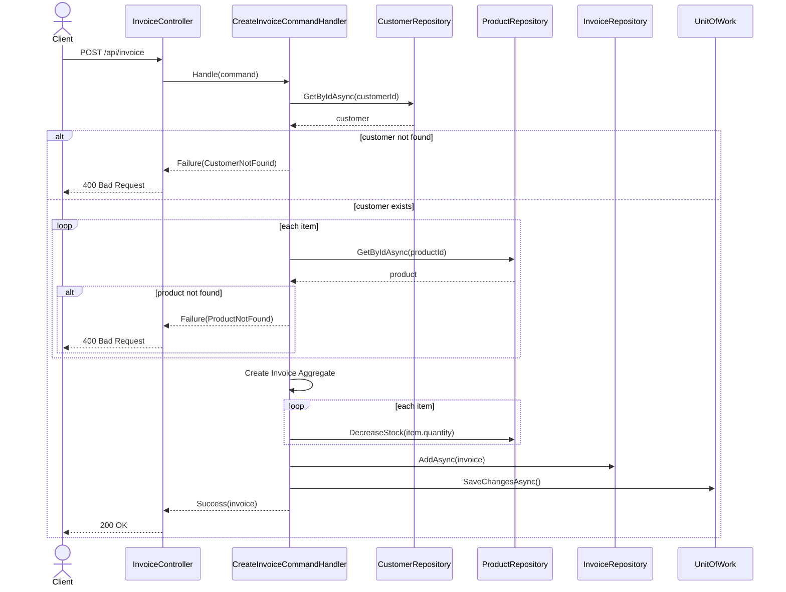

# 🛒 MehrShopping API

A backend e-commerce API built with **.NET 6/7**, **Domain-Driven Design (DDD)**, **CQRS**, and **Entity Framework Core**.

The system manages customers, products, and invoices while integrating with an external **PersonalInfoService** for retrieving customer information.

---

# ✨ Features

## 👥 Customer Management

* Register customers
* Update customer information
* Retrieve customer data
* Integrate with PersonalInfoService

## 📦 Product Management

* Register products
* Delete products
* Manage product catalog

## 🧾 Invoice Management

* Create invoices
* Manage invoice items
* Retrieve invoice lists

## 🌐 External Service Integration

* Communicate with PersonalInfoService through HTTP APIs
* Configurable endpoint and timeout settings

---

# 🏛️ Architecture

The solution follows **Domain-Driven Design (DDD)** principles and is organized into separate layers.

```text
┌───────────────────┐
│       API         │
│ ASP.NET Core MVC  │
└─────────┬─────────┘
          │
          ▼
┌───────────────────┐
│   Application     │
│ Commands/Queries  │
│     Handlers      │
└─────────┬─────────┘
          │
          ▼
┌───────────────────┐
│      Domain       │
│ Business Rules    │
│ Entities          │
│ Value Objects     │
└─────────┬─────────┘
          │
          ▼
┌───────────────────┐
│ Infrastructure    │
│ EF Core           │
│ Repositories      │
│ Unit Of Work      │
│ HTTP Clients      │
└───────────────────┘
```

---

# 📂 Project Structure

```text
src/
├── MehrShopping.Api
├── MehrShopping.Application
├── MehrShopping.Domain
└── MehrShopping.Infrastructure
```

---

# 🎯 Domain Layer

The Domain layer contains the core business model and business rules.

### Responsibilities

* Domain entities
* Value objects
* Domain exceptions
* Repository contracts
* Domain services and business rules

The domain layer remains independent from infrastructure concerns and external frameworks.

---

# ⚡ Application Layer

The Application layer implements the **CQRS** pattern.

### Commands

Commands represent operations that modify system state.

Examples:

* RegisterCustomer
* UpdateCustomer
* RegisterProduct
* DeleteProduct
* CreateInvoice

### Queries

Queries are responsible for retrieving data without modifying state.

Examples:

* GetInvoiceList
* GetCustomer
* GetProduct

### Handlers

Each command and query is processed by a dedicated handler.

```text
Controller
    │
    ▼
Handler
    │
    ▼
Repository / UnitOfWork
```

The project uses CQRS without MediatR, with handlers invoked directly by controllers.

---

# 🗄️ Infrastructure Layer

Infrastructure contains implementations of external dependencies.

### Components

* Entity Framework Core
* SQL Server
* Repository implementations
* Unit Of Work implementation
* EF Core Migrations
* PersonalInfoService client

### Persistence

Data access is managed through repositories and coordinated using the Unit Of Work pattern.

```text
Controller
    │
    ▼
Handler
    │
    ▼
UnitOfWork
    │
    ├── CustomerRepository
    ├── ProductRepository
    └── InvoiceRepository
```

---

# 🌐 PersonalInfoService Integration

MehrShopping integrates with an external PersonalInfoService.

### Communication

```text
MehrShopping API
       │
       ▼
HttpClient
       │
       ▼
PersonalInfoService
```

The service endpoint and timeout values are configured through application settings.

---

# 🔌 API Endpoints

## Customer

| Method | Endpoint        |
| ------ | --------------- |
| POST   | `/api/Customer` |
| PUT    | `/api/Customer` |

## Product

| Method | Endpoint       |
| ------ | -------------- |
| POST   | `/api/Product` |
| DELETE | `/api/Product` |

## Invoice

| Method | Endpoint       |
| ------ | -------------- |
| POST   | `/api/Invoice` |
| GET    | `/api/Invoice` |

---

# 📖 API Documentation

Swagger/OpenAPI is enabled for API exploration and testing.

After running the application:

```text
/swagger
```

provides interactive API documentation.

---

# 👤 Customer Registration Workflow (Detailed Sequence)



# ⚙️ Invoice Creation Workflow (Detailed Sequence)



# ⚙️ Configuration

Configuration is managed through `appsettings.json`.

## Database

```json
{
  "ConnectionStrings": {
    "DefaultConnection": "Server=...;"
  }
}
```

## PersonalInfoService

```json
{
  "PersonalInfoClient": {
    "BaseAddress": "https://localhost:7120/",
    "Timeout": 10
  }
}
```

---

# 🛠️ Build & Run

## Restore Packages

```bash
dotnet restore
```

## Build

```bash
dotnet build
```

## Apply Migrations

```bash
dotnet ef database update
```

## Run Application

```bash
dotnet run
```

---

# 🧪 Testing

The solution supports automated testing for validating business rules and application behavior.

Typical test coverage includes:

* Domain logic
* Application handlers
* Repository behavior
* API endpoints

---

# 🚀 Technology Stack

| Technology            | Purpose                        |
| --------------------- | ------------------------------ |
| .NET 8                | Application Platform           |
| ASP.NET Core MVC      | REST API                       |
| Entity Framework Core | Data Access                    |
| SQL Server            | Database                       |
| Swagger / OpenAPI     | API Documentation              |
| HttpClient            | External Service Communication |
| CQRS                  | Application Architecture       |
| DDD                   | Domain Modeling                |
| Unit Of Work          | Transaction Management         |

---

# 📌 Notes

* Built using Domain-Driven Design (DDD).
* Implements CQRS using dedicated command and query handlers.
* Uses Repository and Unit Of Work patterns.
* Integrates with an external PersonalInfoService through HttpClient.
* Supports SQL Server through Entity Framework Core.
* Includes Swagger documentation for API exploration.

---

# 📄 License

MIT License
